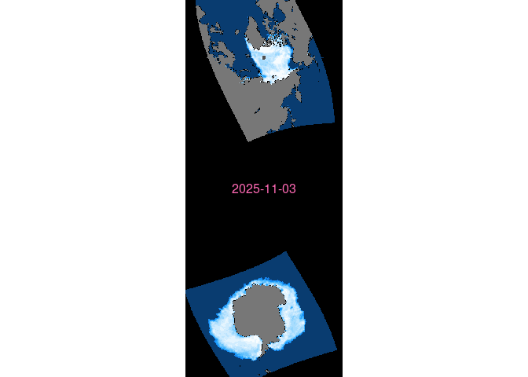

<!-- README.md is generated from README.Rmd. Please edit that file -->

# seaice.map

<!-- badges: start -->

<!-- badges: end -->

The goal of seaice.map is to render a global map of sea ice.

## Installation

You can install the development version of seaice.map from
[GitHub](https://github.com/) with:

``` r
# install.packages("devtools")
devtools::install_github("mdsumner/seaice.map")
```

Everything here runs via targets. The artefacts are stored in on object
storage at

    endpoint: https://projects.pawsey.org.au
    bucket: nuyina.map

Uses path style endpoint/bucket/key. I.e.

    https://projects.pawsey.org.au/nuyina.map/NOAA/G02135/2025/concentration_v4.0_2025-11-10.tif

Index to come.

## Unfinished index

An index is available here, but is not updating yet

    https://projects.pawsey.org.au/nuyina.map/seaice_image_index.parquet

So we can do

``` r
library(terra)
#> terra 1.8.76
dsn <- "/vsicurl/https://projects.pawsey.org.au/nuyina.map/seaice_image_index.parquet"
table <- tail(vect(dsn, what = "attributes"), 100)

one <- table[sample(nrow(table), 1), ]
plot(rast(one$source)); text(0, 0, lab = format(one$date), col = "hotpink")
```



The table of sources has the original files as well:

``` r
as.data.frame(one[c("north", "south")])
#>                                                                                                               north
#> 15525 https://noaadata.apps.nsidc.org/NOAA/G02135/north/daily/geotiff/2025/11_Nov/N_20251103_concentration_v4.0.tif
#>                                                                                                               south
#> 15525 https://noaadata.apps.nsidc.org/NOAA/G02135/south/daily/geotiff/2025/11_Nov/S_20251103_concentration_v4.0.tif
```

## Code of Conduct

Please note that the seaice.map project is released with a [Contributor
Code of
Conduct](https://contributor-covenant.org/version/2/1/CODE_OF_CONDUCT.html).
By contributing to this project, you agree to abide by its terms.
