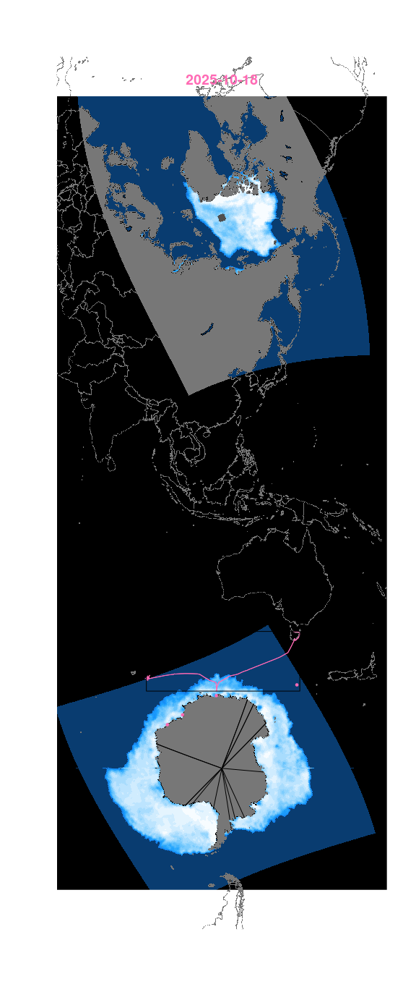
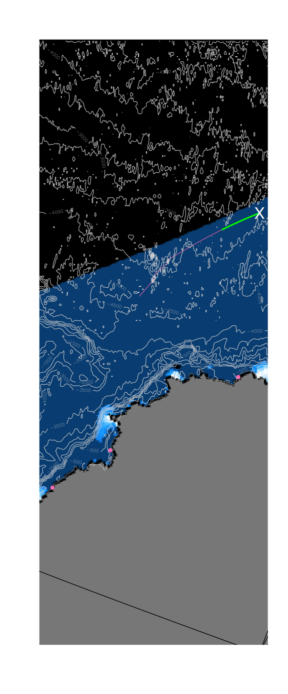
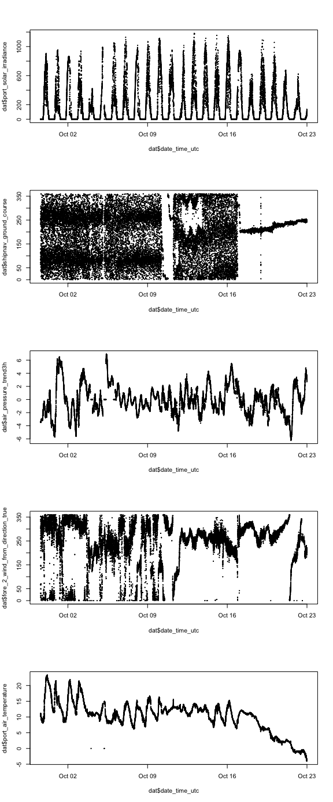

<!-- README.md is generated from README.Rmd. Please edit that file -->

# seaice.map

<!-- badges: start -->
<!-- [](https://github.com/mdsumner/seaice.map/actions/workflows/R-CMD-check.yaml)-->
<!-- badges: end -->

The goal of seaice.map is to

- download very latest available sea ice concentration data
- generate a global map of the data with a customizable focus
  (i.e. global but centred on Tasmania/East Antarctica)
- also show some contextual spatio-temporal data (i.e. recent movements
  of a research vessel)
- explicate how to do this all with free tools.

``` r
library(terra)
#> terra 1.7.55
r <- vapour::gdal_raster_data("data-raw/seaice.png", bands = 1:3)
pcrs <- attr(r, "projection")
ximage::ximage(r, asp = 1, axes = FALSE)
points(terra::project(do.call(cbind, maps::map(plot = F)[1:2]), to = pcrs, from = "OGC:CRS84"), pch = ".", col = "#777777")
title(readLines("data-raw/latestdate.txt"), line = -2, col.main = "white")


n <- 30 * 24 * 60

dat <- arrow::read_parquet("data-raw/nuyina_underway.parquet")


print(range( dat$date_time_utc))
#> [1] "2021/12/23 05:00:00+00" "2023/10/17 11:59:00+00"
dat <- tibble::as_tibble(dat)
dat <- tail(dat, n)
dat$date_time_utc <- as.POSIXct(dat$date_time_utc, "%Y/%m/%d %H:%M:%S", tz = "UTC")

track <- cbind(dat$longitude, dat$latitude)

track <- terra::project(as.matrix(track), to = pcrs, from = "OGC:CRS84")
lines(track, col = "hotpink")
pt <- tail(track[!is.na(track[,1]) & !is.na(track[,2]), ], 1L)
points(pt, pch = "+", col = "hotpink")
bx <- c(range(track[,1], na.rm = TRUE), range(track[,2], na.rm = TRUE))
rect(bx[1], bx[3], bx[2], bx[4])
```

<!-- -->

``` r


# CGAZ <- "/vsizip//vsicurl/https://github.com/wmgeolab/geoBoundaries/raw/main/releaseData/CGAZ/geoBoundariesCGAZ_ADM0.zip"
# CGAZ_sql <- "SELECT shapeGroup FROM geoBoundariesCGAZ_ADM0 WHERE shapeGroup IN ('AUS','NZL','ATA')"
# map <- terra::vect(CGAZ, query = CGAZ_sql)
# #terra::writeVector(map, "data-raw/CGAZ.parquet", filetype = "Parquet")
# terra::writeVector(map, "data-raw/CGAZ.fgb", filetype = "FlatGeoBuf")


map <- terra::vect("data-raw/CGAZ.fgb")
plot(track, type = "n", asp = 1)
title(paste0(as.Date(range(dat$date_time_utc)),collapse = ","), col.main = "white")
#plotRGB(r, add = TRUE)
ximage::ximage(r, add = TRUE)
lines(track, col = "hotpink")
plot(terra::project(map, pcrs), add = TRUE, border = "#777777")
```

<!-- -->

``` r


bad <- is.na(dat$date_time_utc) | is.na(dat$port_solar_irradiance) | is.na(dat$air_pressure_trend3h) | 
  is.na(dat$fore_2_wind_from_direction_true) | is.na(dat$port_air_temperature)
if (any(!bad)) {
  dat <- dat[!bad, ]
par(mfrow = c(5, 1))
plot(dat$date_time_utc, dat$port_solar_irradiance, pch = 19, cex = .2)
plot(dat$date_time_utc, dat$shipnav_ground_course, pch = 19, cex = .2)
plot(dat$date_time_utc, dat$air_pressure_trend3h, pch = 19, cex = .2)
plot(dat$date_time_utc, dat$fore_2_wind_from_direction_true, pch = 19, cex = .2)
plot(dat$date_time_utc, dat$port_air_temperature, pch = 19, cex = .2)

}
```

<!-- -->

This is 25km sea ice concentration from NSIDC, reprojected from images
published by NOAA at <https://noaadata.apps.nsidc.org/NOAA/G02135/> (the
projection is Transverse Mercator with central longitude 147).

The point (and track if available) is the recent position of the [Nuyina
research vessel](https://www.antarctica.gov.au/nuyina/) taken from the
underway data that measures atmospheric and water properties.

Files in ‘data-raw/’ contain the actual metadata and scripts. This runs
as a daily task on github actions.

## Code of Conduct

Please note that the seaice.map project is released with a [Contributor
Code of
Conduct](https://contributor-covenant.org/version/2/1/CODE_OF_CONDUCT.html).
By contributing to this project, you agree to abide by its terms.
